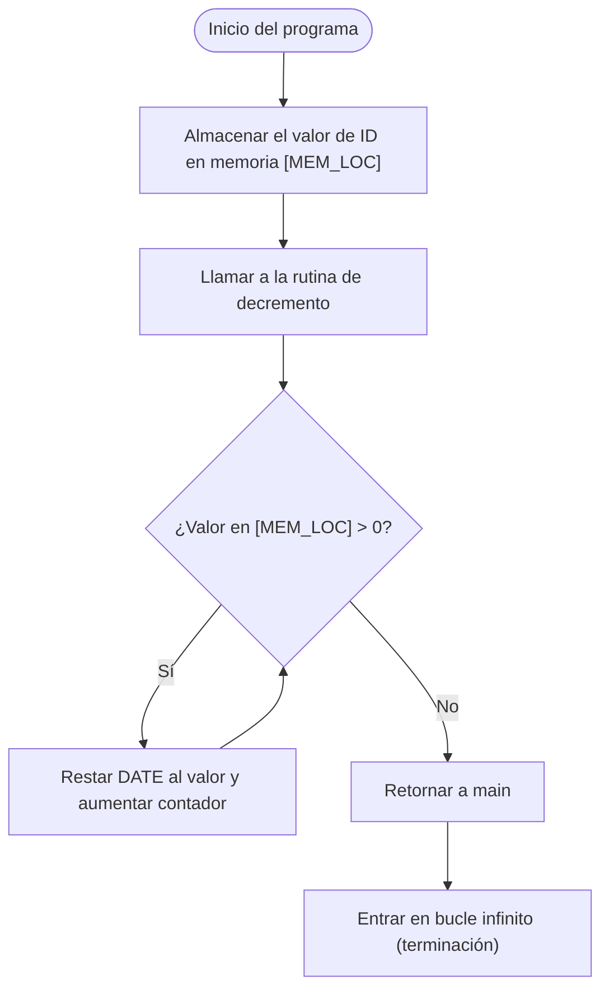

# ASM_CONFIG.md
> **Referencia:**
> Zhu, Yifen. *Embedded Systems with ARM Cortex-M Microcontrollers in Assembly Language and C*, 2nd Edition, 2022. ***Capítulos 3 al 6 recomendados para esta sección***

## 1. Objetivo

Profundizar en la configuración y edición del archivo ensamblador `main.s`, entender las directivas clave y organizar el código ASM para la práctica de Procesadores.

## 2. Estructura del archivo ASM

- **.section .text**: Ubica el ensamblador en la región de código ejecutable.
- **.syntax unified**: Sintaxis única para instrucciones ARM y Thumb.
- **.thumb**: Indica instrucciones Thumb.
- **.global main**: Expone `main` al enlazador para el startup.
- **.equ**: Define constantes simbólicas para memoria y valores.

```assembly
    .section .text            @ Código ejecutable
    .syntax unified           @ Sintaxis unificada ARM/Thumb
    .thumb                    @ Genera instrucciones Thumb (16/32 bits)
    .global main              @ Hacer visible la etiqueta main

    .equ MEM_LOC, 0x20000010  @ Dirección fija en SRAM para datos
    .equ ID, 0x813017         @ Valor a decrementar
    .equ DATE, 0x1017         @ Fecha de nacimiento
```  

## 3. Definición de la función `main`

Implementa en ASM la rutina principal que inicializa datos y llama a una subrutina:

```assembly
main:
    @ Inicializar registros
    movw    r0, #:lower16:MEM_LOC    @ Parte baja de la dirección
    movt    r0, #:upper16:MEM_LOC    @ Parte alta (ahora R0 = MEM_LOC)
    ldr     r1, =ID                  @ Cargar ID en r1
    str     r1, [r0]                 @ Almacena valor en MEM_LOC

    @ Llamar a la subrutina decrement
    bl      decrement

    @ Bucle infinito de final
loop:
    b       loop
```

| Instrucción      | Registros/Memoria                   | Comentario                                           |
|------------------|-------------------------------------|------------------------------------------------------|
| movw r0,...      | R0[15:0] = lower16(MEM_LOC)         | Carga los 16 bits bajos de la dirección MEM_LOC.     |
| movt r0,...      | R0[31:16] = upper16(MEM_LOC)        | Completa la dirección de 32 bits en R0.              |
| ldr r1, =ID      | R1 = 0x813017                       | Carga el valor ID mediante pseudo-instrucción.       |
| str r1, [r0]     | Mem[MEM_LOC] = 0x813017             | Guarda el valor ID en la SRAM.                       |
| bl decrement     | LR = PC+4; PC = &decrement          | Salta a `decrement`, guardando la dirección de retorno. |
| loop: b loop     | PC = loop                           | Bucle infinito tras retornar de `decrement`.         |

---

## 4. Implementación de la rutina `decrement`

Esta subrutina decrementa el valor en memoria hasta que sea ≤ 0 y cuenta iteraciones:

```assembly
decrement:
    @ r0 apunta a MEM_LOC, obtener valor
    ldr     r1, [r0]           @ Cargar valor de MEM_LOC en r1
    ldr     r2, =DATE          @ Cargar fecha en r2
    subs    r1, r1, r2         @ r1 = r1 - r2
    str     r1, [r0]           @ guarda r1 en MEM_LOC
    cmp     r1, #0             @ ¿ r1 ≤ 0?
    ble     exit_decrement     @ Si sí, salir

    @ Iteración válida
    add     r7, r7, #1         @ Contador en r7
    b       decrement          @ Repetir

exit_decrement:
    @ Retorno a main
    bx      lr
```  

| Instrucción       | Registros/Memoria                 | Comentario                                           |
|-------------------|-----------------------------------|------------------------------------------------------|
| ldr r1, [r0]      | R1 = Mem[MEM_LOC]                 | Carga el valor actual de memoria en R1.              |
| ldr r2, =DATE     | R2 = 0x1017                       | Carga la constante DATE en R2.                       |
| subs r1, r1, r2   | R1 = R1 - R2; flags Z y N         | Resta DATE al valor en memoria y actualiza flags.    |
| str r1, [r0]      | Mem[MEM_LOC] = R1                 | Escribe el resultado de vuelta en memoria.           |
| cmp r1, #0        | Ajusta flags Z y N                | Compara con cero para evaluar condición de salida.   |
| ble exit_decrement| PC = exit_decrement               | Salta a `exit_decrement` si ≤ 0.                     |
| add r7, r7, #1    | R7 = R7 + 1                       | Incrementa contador de iteraciones en R7.            |
| b decrement       | PC = decrement                    | Repite la rutina hasta la condición de salida.       |
| bx lr             | PC = LR                           | Retorna a la llamada en `main`.                      |

---

## 5. Implementación de `main.s`

Asegúrate de no copiar codigo repetido e incluir los encabezados y funciones necesarias.

El archivo de `main.s` deberia lucir de la siguiente manera:

```assembly
    .section .text            @ Código ejecutable
    .syntax unified           @ Sintaxis unificada ARM/Thumb
    .thumb                    @ Genera instrucciones Thumb (16/32 bits)
    .global main              @ Hacer visible la etiqueta main

    .equ MEM_LOC, 0x20000010  @ Dirección fija en SRAM para datos
    .equ ID, 0x813017         @ Valor a decrementar
    .equ DATE, 0x1017         @ Fecha de nacimiento

main:
    @ Inicializar registros
    movw    r0, #:lower16:MEM_LOC    @ Parte baja de la dirección
    movt    r0, #:upper16:MEM_LOC    @ Parte alta (ahora R0 = MEM_LOC)
    ldr     r1, =ID                  @ Cargar ID en r1
    str     r1, [r0]                 @ Almacena valor en MEM_LOC

    @ Llamar a la subrutina decrement
    bl      decrement

    @ Bucle infinito de final
loop:
    b       loop


decrement:
    @ r0 apunta a MEM_LOC, obtener valor
    ldr     r1, [r0]           @ Cargar valor de MEM_LOC en r1
    ldr     r2, =DATE          @ Cargar fecha en r2
    subs    r1, r1, r2         @ r1 = r1 - r2
    str     r1, [r0]           @ guarda r1 en MEM_LOC
    cmp     r1, #0             @ ¿ r1 ≤ 0?
    ble     exit_decrement     @ Si sí, salir

    @ Iteración válida
    add     r7, r7, #1         @ Contador en r7
    b       decrement          @ Repetir

exit_decrement:
    @ Retorno a main
    bx      lr

```

## 6. Visualización de flujo del programa

Puedes renderizar el siguiente diagrama de flujo usando [Mermaid](https://mermaid.live/).


Con esta explicación, deberías comprender cómo funciona el código a nivel de ISA y registros en la placa NUCLEO‑L476RG.

## 7. Depuración en VS Code

1. Coloca breakpoints en `main` o `decrement` para inspeccionar registros.
2. Inicia la depuración y observa cómo avanza la ejecución línea a línea y como cambia el valor de:
    - Los registros del procesador.
    - La memoria del programa.
    - El contador del programa.

---

Continúa con [WORKSHOP.md](3_WORKSHOP_ASM.md) para ejercitar lo aprendido acerca del procesador y lenguaje ensamblador.
